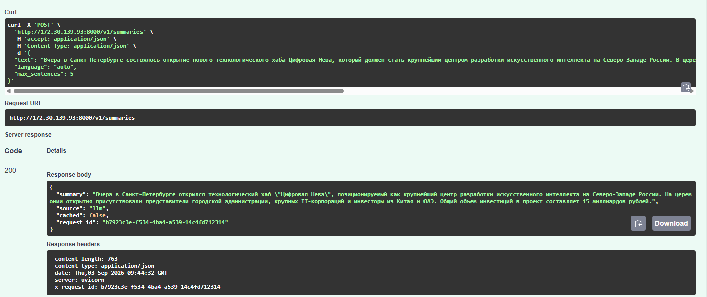
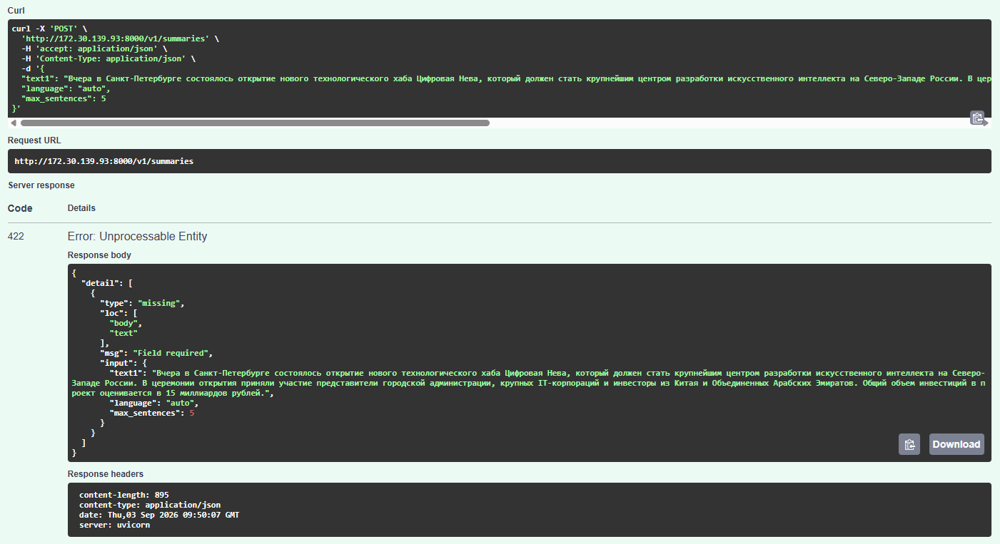
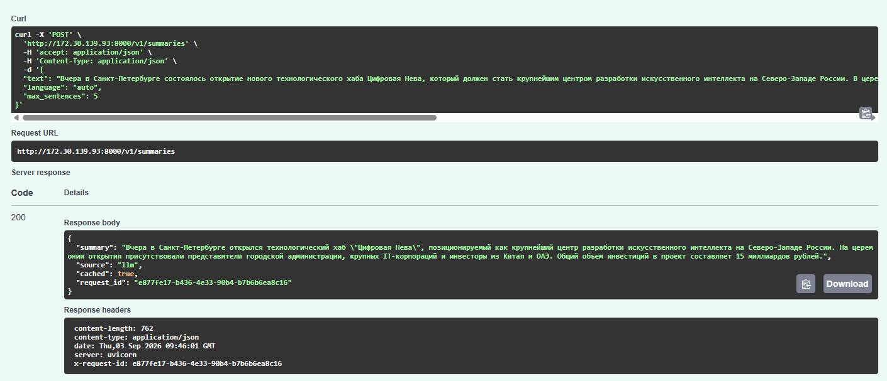
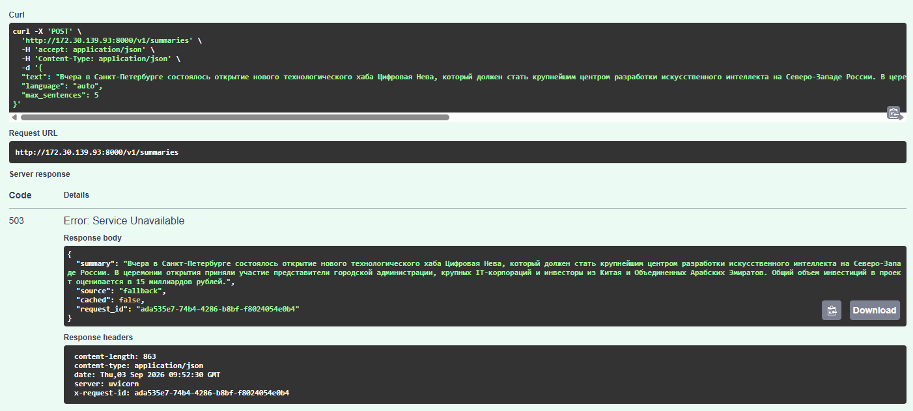
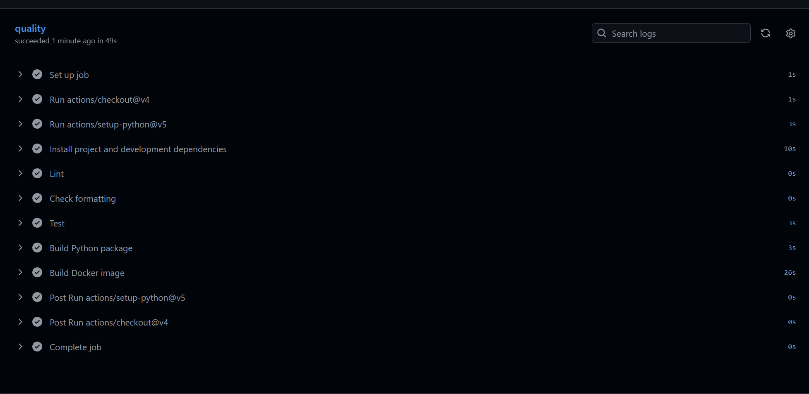

# LLM Summarizer

[](https://github.com/baibakovkir/ai-netology-final/actions/workflows/ci.yml)

Веб-приложение для автоматического сокращения текстов на русском и английском языках с использованием больших языковых моделей, поддерживающих OpenAI Chat Completions API. Реализует чистую архитектуру с разделением уровней, graceful degradation при сбоях, встроенное кеширование, секурную обработку конфиденциальных данных, комплексные тесты и автоматизированный CI/CD.

## Обработка запроса

```text
POST /v1/summaries
        │
        ├── проверка и нормализация входных данных
        ├── поиск результата в памяти (TTL-кеш)
        ├── подготовка системного и пользовательского контекста
        ├── обращение к LLM с обработкой таймаутов и повторных попыток
        ├── обработка и валидация ответа модели
        └── 200 + краткое содержание
                 либо
             503 + резервный вывод
```

При недоступности модели система возвращает резервный вывод — отрывок из начала исходного текста. Резервный результат не сохраняется в кеш, поэтому при следующем обращении будет предпринята новая попытка подключения к модели. Кеширование работает на уровне процесса приложения и сбрасывается после перезагрузки сервера.

Приложение скрывает API-ключи и полные версии пользовательских данных в логах. Для отслеживания цепочки событий используется уникальный идентификатор `X-Request-ID`, который может быть предоставлен клиентом или сгенерирован самим сервером.

## Развертывание с Docker

Убедитесь, что установлены Docker и Docker Compose.

```bash
cp .env.example .env
# Установите APP_LLM_API_KEY и при необходимости измените URL/модель в .env
docker compose up --build
```

Приложение станет доступно по адресу <http://localhost:8000>, интерактивная документация находится на <http://localhost:8000/docs>. Проверка здоровья не требует обращения к внешней модели:

```bash
curl http://localhost:8000/health
```

Приложение запустится даже без API-ключа, но запросы к методу суммаризации вернут `503` с резервным результатом.

## Установка и локальный запуск

Требуется Python 3.12 или выше:

```bash
python3 -m venv .venv
source .venv/bin/activate
python -m pip install -e '.[dev]'
cp .env.example .env
uvicorn llm_summarizer.main:app --reload
```

## API

### `POST /v1/summaries`

Параметры запроса:

| Параметр | Тип | Диапазон | Значение по умолчанию |
|---|---|---|---|
| `text` | string | 50–20 000 символов после нормализации | необходимый параметр |
| `language` | string | `auto`, `ru`, `en` | `auto` |
| `max_sentences` | integer | 1–10 | 5 |

При установке `language=auto` язык резюме автоматически совпадает с языком исходного текста.

```bash
curl -i http://localhost:8000/v1/summaries \
  -H 'Content-Type: application/json' \
  -H 'X-Request-ID: demo-001' \
  -d '{
    "text": "Большой исходный текст должен содержать не менее пятидесяти символов. Сервис выделит его основные мысли и вернет короткое резюме.",
    "language": "ru",
    "max_sentences": 2
  }'
```

Успешный ответ (HTTP 200):

```json
{
  "summary": "Сервис выделяет основные мысли длинного текста и возвращает краткое резюме.",
  "source": "llm",
  "cached": false,
  "request_id": "demo-001"
}
```

При недоступности модели после всех повторных попыток возвращается HTTP 503:

```json
{
  "summary": "Большой исходный текст должен содержать не менее пятидесяти символов.",
  "source": "fallback",
  "cached": false,
  "request_id": "demo-001"
}
```

Ошибки валидации возвращают HTTP 422 с подробным описанием.

### `GET /health`

Возвращает HTTP 200 с `{\"status\":\"ok\"}`. Указывает, что приложение готово обрабатывать запросы.

## Конфигурация

Все параметры имеют префикс `APP_`. Полный список см. в `.env.example`.

| Переменная | Описание |
|---|---|
| `APP_ENVIRONMENT` | Режим работы: `dev` или `prod` |
| `APP_LOG_LEVEL` | Уровень детализации структурированных логов |
| `APP_LLM_BASE_URL` | Адрес API с версией (например `.../v1`) |
| `APP_LLM_API_KEY` | Секретный ключ (не коммитить в репозиторий) |
| `APP_LLM_MODEL` | Название модели |
| `APP_LLM_CONNECT_TIMEOUT_SECONDS` | Таймаут установления соединения |
| `APP_LLM_READ_TIMEOUT_SECONDS` | Таймаут получения ответа |
| `APP_LLM_RETRIES` | Количество повторных попыток (0–5) |
| `APP_LLM_RETRY_BACKOFF_SECONDS` | Базовая задержка между повторами |
| `APP_CACHE_TTL_SECONDS` | Время жизни кешированного результата |
| `APP_CACHE_MAX_ENTRIES` | Максимальное количество записей в кеше |
| `APP_PROMPT_VERSION` | Версия промпта (учитывается при кешировании) |

Повторные попытки выполняются при сетевых ошибках, таймаутах, HTTP 429 и 5xx. Ошибки аутентификации и некорректные ответы не повторяются.

## Разработка и тестирование

```bash
ruff check .
ruff format --check .
pytest
python -m build
```

GitHub Actions автоматически выполняет эти проверки, собирает Docker-образ при каждом push и Pull Request. Подробные инструкции для ручного тестирования находятся в [TESTING.md](TESTING.md).

## Примеры использования

Успешный ответ от модели (HTTP 200, `source=llm`):



Ошибка при валидации входных данных (HTTP 422):



Кеширование при повторном запросе (`cached=true`):



Резервный результат при недоступности модели (HTTP 503, `source=fallback`):



Успешное прохождение всех проверок CI (GitHub Actions):



## Организация проекта

```text
src/llm_summarizer/  основной код — API, настройки, интеграция с LLM и бизнес-логика
tests/               набор автоматических тестов
.github/             конфигурация CI и шаблоны
Dockerfile           многоэтапный образ для production
compose.yaml         локальное развертывание и проверки
```
